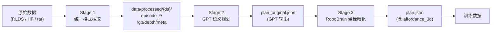

# 数据集处理流程

> 状态：截至 2026-04-27，已标注 27,061 个 episode，提供 101,205 个 (RGB, 3D-point) 监督对，覆盖 7 个数据集。
>
> 设计目标：为 VLA 模型增加 depth 模态时提供 depth encoder 冷启动所需的 cross-modal 监督信号。

---

## 总览

整个数据集从原始 robotics dataset 到训练用 plan.json 的处理流程分三个阶段：



**核心产物**：每个 episode 一个 `plan.json`，里面每个 step 提供 `(affordance, affordance_3d)` —— 即一个 2D 像素点和它在相机系下的 3D 坐标。这是 depth encoder 学习 RGB↔depth 模态对齐的核心监督信号。

---

## Stage 1: 原始数据 → 统一格式

**入口**: `scripts/data_pipeline/run_pipeline.py`

支持 9 个数据集，按"小→大、本地→远程"顺序处理：

| 优先级 | 数据集 | 来源 | 原生 depth | 用途 |
|---|---|---|---|---|
| 1 | rlbench | 本地 PNG+pkl | ✓ | 仿真高质量 |
| 2 | aloha | lerobot/aloha_static_* | ✗ | 双臂 OOD |
| 3 | utokyo_xarm_bimanual | jxu124/OpenX-Embodiment | ✗ | 双臂 OOD |
| 4 | berkeley_cable_routing | jxu124/OpenX-Embodiment | ✗ | 长程任务 |
| 5 | taco_play | jxu124/OpenX-Embodiment | ✓ | 中规模真机 |
| 6 | jaco_play | jxu124/OpenX-Embodiment | ✗ | 中规模真机 |
| 7 | nyu_franka_play | jxu124/OpenX-Embodiment | ✗ | 中规模真机 |
| 8 | bridge | jxu124/OpenX-Embodiment | ✗ | 大规模 |
| 9 | furniture_bench | jxu124/OpenX-Embodiment | ✗ | 长程任务 |
| 10 | fractal20220817_data | jxu124/OpenX-Embodiment | ✗ | 大规模真机 |
| 11 | rh20t | huangwl18/RH20T | ✓ | 中规模真机 |
| 12 | droid | DROID HF | ✗ | 最大规模真机 |

### 1.1 流处理设计

每个数据集有一个 downloader adapter（`scripts/data_pipeline/downloaders/*.py`），yield 单个 episode；主循环消费一个 episode 后立即处理并写盘，**源数据不留磁盘**。这是为了在 1TB 磁盘内处理 ~178k episode。

### 1.2 关键帧抽取 (`keyframe_extractor.py`)

每条 trajectory 抽 5 帧 keyframe：
- **优先策略**：基于 action delta 幅度，用高斯平滑 + 贪心 peak picking，强制最小 gap = `T/6`
- **fallback**：如无 action 或 trajectory 长度 < 5，用均匀采样

```python
# core algorithm
deltas = np.linalg.norm(np.diff(actions, axis=0), axis=-1)
deltas = gaussian_filter1d(deltas, sigma=3)
# greedily pick top-N peaks, respecting min_gap = T // 6
```

输出：keyframe indices ∈ `[0, 1, ..., T-1]`，固定包含首尾帧。

### 1.3 深度生成 (`depth_generator.py`)

| 数据集 | 来源 | 处理 |
|---|---|---|
| rlbench, taco_play, rh20t, nyu_franka | 原生 depth | 直接采纳 |
| 其它（bridge, droid, fractal, ...） | **Depth Anything V2 Large** | 推理 + 归一化到 `[0.01, 5.0]` |

伪深度归一化策略（`depth_generator.py:33-36`）：
```python
depth = 0.01 + 4.99 * (depth - dmin) / (dmax - dmin)
```

⚠ **限制**：伪深度是 **相对深度（ordinal depth）线性映射到一个固定区间**，不是真实米制单位。`affordance_3d` 在伪深度数据集上是"一致但任意尺度"的，跨数据集比较 z 值无意义，但同 episode 内的相对结构正确。

### 1.4 输出格式

所有数据集统一为：

```
data/processed/{dataset_name}/episode_{N:06d}/
├── rgb_0.png        # 256×256 RGB
├── rgb_1.png
├── rgb_2.png
├── rgb_3.png
├── rgb_4.png
├── depth_0.npy      # 256×256 float32, [0.01, 5.0]
├── depth_1.npy
├── depth_2.npy
├── depth_3.npy
├── depth_4.npy
└── meta.json
```

`meta.json` 字段：

```json
{
  "task": "Pick up the red block...",
  "intrinsics": [[fx, 0, cx], [0, fy, cy], [0, 0, 1]],
  "keyframe_indices": [0, 12, 27, 38, 56],
  "source": "rh20t",
  "episode_id": "episode_000000",
  "depth_type": "native | pseudo",
  "robot": "ur5 | franka | ...",
  "num_frames_total": 56,
  "num_keyframes": 5
}
```

`intrinsics` fallback：当 downloader 未提供时使用 `[[222.7, 0, 128], [0, 222.7, 128], [0, 0, 1]]`（256×256 图像、约 60° FOV 的合成相机）。

---

## Stage 2: GPT 语义规划

**入口**: `scripts/generate_plans.py` (单帧) 或 `scripts/regenerate_plans_keyframe.py` (多关键帧)

将 `task` 字符串 + 场景图像送给 GPT，输出结构化的 manipulation plan。

### 2.1 模型与配置

```bash
PLAN_MODEL=gpt-4o-mini  # 默认（历史选择，已知略弱）
PLAN_MODEL=gpt-4o       # 推荐升级
OPENAI_BASE_URL=https://yunwu.ai/v1
```

API 通过 `openai` Python SDK + `chat.completions.create()`，`temperature=0.2-0.3`。

### 2.2 Prompt 结构

**System prompt** 定义角色（"RoboBrain, embodied AI planner"）+ 输出 schema：

- 步骤数量：2-6 步
- 操作原语 (12 种)：`reach, grasp, transport, place, push, pull, insert, pour, rotate, release, flip, wipe`
- 约束分类 (5 类)：`contact, spatial, pose, direction, safety`
- 约束角色 (3 类)：`completion, safety, progress`

**User prompt** 包含：
- 1-2 个 few-shot 示例（pick-place / open drawer）
- 当前 task 描述 + 场景图（base64）
- 强制要求：仅返回 JSON，不要 markdown fence

### 2.3 单帧 vs 多帧

| 脚本 | 输入 | 用途 |
|---|---|---|
| `generate_plans.py` | `rgb_0.png`（初始帧） | 首次大规模标注 |
| `regenerate_plans_keyframe.py` | `rgb_0.png ... rgb_N.png`（全部 keyframe） | 重生成、尤其修复 affordance 分散问题 |

多帧 prompt 额外要求："Different steps acting on DIFFERENT objects MUST have DIFFERENT affordance coordinates"，缓解 GPT 对所有 step 给同一坐标的幻觉。

### 2.4 解析与验证

`extract_json()` 处理两类常见污染：
1. ` ```json ... ``` ` markdown fence
2. 前后缀解释文字

`validate_plan()` 检查：
- 顶层包含 `task` + `steps`
- `steps` 为非空 list
- 每个 step 有 `action` + `target`
- `scene_objects` 为字符串列表（自动修正 dict 列表）

失败重试 2 次。最终输出写到 `episode_*/plan.json`（首次写入）或 `plan_original.json`（regen 备份）。

### 2.5 多 worker 并行

`generate_plans.py` 使用 `ThreadPoolExecutor`（默认 4 worker），适合 OpenAI API 的并发写。

---

## Stage 3: RoboBrain 坐标精化 + 3D 反投影

**入口**: `scripts/refine_affordance_robobrain.py`

将 GPT 给出的粗糙 2D affordance 替换为 RoboBrain2.5-8B 的 grounded pointing 输出，并用深度图反投影到 3D。

### 3.1 模型

- **路径**：`/home/edge/Embodied/models/RoboBrain2.5-8B-NV`
- **架构**：基于 Qwen2.5-VL，加 robotic pointing 微调
- **接口**：`UnifiedInference(text, image, task="pointing", do_sample=False)`
  - 输入：单张 RGB 图像路径 + 文本 query
  - 输出：`(x, y)` 坐标，范围 `[0, 1000]`²

### 3.2 Query 解析规则

`resolve_query(step)` 决定为 step 找哪个物体的位置：

```python
DESTINATION_ACTIONS = {"transport", "place", "insert", "pour"}

if step.action in DESTINATION_ACTIONS and step.destination:
    query = step.destination       # 这些动作的 affordance 是放置点
else:
    query = step.target             # 其它动作 affordance 在被操作物体上
```

⚠ **已知陷阱**：当 GPT 漏写 `destination` 字段，`place(mug)` 步会回退到 `query="mug"`，导致 affordance 指向 mug 初始位置而不是放置目的地。详见"已知问题"章节。

### 3.3 Per-episode query cache

同一 episode 内对同一 query 只调用 RoboBrain 一次：

```python
cache: dict[str, tuple[float, float]] = {}
for step in plan["steps"]:
    q = resolve_query(step)
    if q in cache:
        new_aff = cache[q]   # 复用
    else:
        new_aff = robobrain_pointing(rgb_path, q)
        cache[q] = new_aff
```

性能影响：3-4 step 的 episode 通常只需 1-2 次 RoboBrain 推理。

### 3.4 2D → 3D 反投影

`pixel_to_3d(u, v, depth_map, intrinsics)`:

```python
px, py = round(u * w), round(v * h)
z = depth_map[py, px]
if z < 0.01 or z > 10.0 or isnan(z): return None
x_cam = (px - cx) / fx * z
y_cam = (py - cy) / fy * z
return [x_cam, y_cam, z]
```

写入 `step["affordance_3d"]`（如 depth/intrinsics 缺失则跳过）。

### 3.5 备份与恢复

- 首次 refine 备份原 plan 到 `plan_before_robobrain.json`
- regen 流程额外备份到 `plan_original.json`
- 三个文件并存可追溯每阶段状态

---

## Stage 3.5（补丁）: affordance_3d 回填

**入口**: `scripts/backfill_affordance_3d.py`

**背景**：rlbench 等数据集的 RoboBrain refine 在 depth 文件生成之前就跑过了，导致 1800 个 episode / 7,136 个 step 的 `affordance_3d` 字段缺失。

**做法**：直接复用现有 `affordance` + `depth_0.npy` + `meta.intrinsics`，纯 numpy 反投影，不调用任何模型。

```bash
python scripts/backfill_affordance_3d.py --dataset rlbench
python scripts/backfill_affordance_3d.py --all --dry-run
```

性能：1800 episode / 3 秒 CPU。

修复后效果：rlbench 从 0% 覆盖提升到 100%，全数据集监督 pair 从 ~94k 增至 **101,205**。

---

## 输出 schema

### plan.json 完整结构

```json
{
  "task": "Pick up the red block and place it on the blue plate",
  "scene_objects": ["red_block", "blue_plate", "table"],
  "num_steps": 4,
  "steps": [
    {
      "step": 1,
      "action": "reach",
      "target": "red_block",
      "affordance": [0.35, 0.48],
      "affordance_3d": [-0.21, 0.03, 1.34],
      "approach": [0.0, 0.0, -1.0],
      "constraints": {
        "contact":  [{"pred": "gripper_state", "args": ["open"], "role": "progress"}],
        "spatial":  [{"pred": "distance", "args": ["gripper", "red_block", "<", 0.03], "role": "completion"}],
        "safety":   [{"pred": "no_collision", "args": ["gripper", "blue_plate"]}]
      },
      "done_when": "distance(gripper, red_block) < 0.03 AND gripper_state(open)"
    }
  ]
}
```

### 字段说明

| 字段 | 类型 | 来源 | 说明 |
|---|---|---|---|
| `task` | string | meta.json | 自然语言任务描述 |
| `scene_objects` | list[str] | GPT | 场景中相关物体列表 |
| `num_steps` | int | GPT | 与 `len(steps)` 一致（脚本会自动归一化） |
| `step` | int | GPT | 步骤序号，1-indexed |
| `action` | string | GPT | 12 种操作原语之一 |
| `target` | string | GPT | 被操作物体名称 |
| `destination` | string \| null | GPT | place/transport/insert/pour 的目的地（**易漏写**） |
| `affordance` | [u, v] in [0,1] | RoboBrain | 2D 归一化坐标 |
| `affordance_3d` | [x, y, z] | back-proj | 相机系 3D 坐标，z 单位米（原生）或相对（伪深度） |
| `approach` | [dx, dy, dz] | GPT | 末端执行器接近方向 |
| `constraints` | dict | GPT | 5 类约束，详见 prompt |
| `done_when` | string | GPT | 完成判定的人类可读表达式 |

---

## 当前数据集状况

### 数据规模（截至 2026-04-27）

| 数据集 | episode 总数 | 已标注 plan | aff_3d 覆盖率 | 监督 pair 数 |
|---|---:|---:|---:|---:|
| bridge | 25,446 | 6,292 | 100% | 24,767 |
| droid | 49,920 | 8,987 | 100% | 36,720 |
| fractal20220817_data | 86,586 | 2,756 | 100% | 10,090 |
| jaco_play | 976 | 896 | 100% | 2,926 |
| rh20t | 3,764 | 3,394 | 100% | 11,888 |
| rlbench | 1,800 | 1,800 | 100% | 7,136 |
| taco_play | 3,242 | 2,936 | 85.3% | 7,678 |
| **小计** | 171,734 | **27,061** | **99.0%** | **101,205** |
| aloha (未标注) | 20 | 0 | – | – |
| berkeley_cable_routing (未标注) | 1,403 | 0 | – | – |
| furniture_bench (未标注) | 5,100 | 0 | – | – |
| nyu_franka_play (未标注) | 365 | 0 | – | – |
| utokyo_xarm_bimanual (未标注) | 63 | 0 | – | – |
| **总计** | **178,685** | 27,061 | – | – |

### 深度尺度分布

| 数据集 | depth_type | mean(z) | p10 | p90 |
|---|---|---|---|---|
| rh20t | native | 1.77m | 1.34 | 2.28 |
| taco_play | native | 1.64m | 1.42 | 1.92 |
| rlbench | native | 2.39m | 0.47 | 4.51 |
| bridge | pseudo | 2.13 | 1.26 | 2.98 |
| droid | pseudo | 2.03 | 0.87 | 3.34 |
| fractal | pseudo | 3.35 | 2.24 | 4.49 |
| jaco_play | pseudo | 2.91 | 2.16 | 3.59 |

⚠ 跨数据集 z 值不可直接比较（pseudo depth 是相对单位）。同一数据集内分布有效。

### Episode 内 3D 多样性 (`unique_z/ep`)

```
bridge:    1.93   ← 平均每 episode 含 ~2 个独立深度点
droid:     1.95
fractal:   1.67
rh20t:     1.59
rlbench:   1.85
jaco_play: 1.50   ← 偏低，主要由于 destination 漏写
taco_play: 1.35   ← 偏低，部分由于 destination 漏写 + depth invalid
```

理论上限是 `avg_steps`（约 3-4），实际偏低反映了"同一物体不同步骤被 cache 合并"+"缺 destination 字段"两个效应。

---

## 辅助 / 维护脚本

| 脚本 | 用途 |
|---|---|
| `clean_plan_schema.py` | 清理 GPT 偶发的 schema 违规（"constraints": "similar to above" 之类的字符串占位） |
| `analyze_task_distribution.py` | 跨数据集 task / robot / depth_type 分布统计 |
| `select_30k_subset.py` | 分层抽样 + 语义去重，输出 train/val/test_id/test_ood 分割文件 |
| `pilot_verify_datasets.py` | 小样本 pipeline 验证，对比 GPT 与 RoboBrain affordance 偏差 |
| `verify_affordance_robobrain.py` | 可视化 GPT vs RoboBrain 点位（蓝/红覆盖到原图） |
| `diagnose_robobrain_pointing.py` | 大样本统计 RoboBrain pointing 失败率（parse_fail / bad_rgb / bad_depth / ok 四类） |
| `fix_task_descriptions.py` | 修补 ALOHA 等数据集的简略任务名 |
| `resolution_experiment.py` | 测量图像分辨率（256/512/1024）对 GPT pointing 精度的影响 |
| `backfill_affordance_3d.py` | **新增**：补齐缺失的 `affordance_3d` 字段（无需调用模型） |

---

## 已知问题与近期修复

### ✓ 已修复

#### rlbench 的 affordance_3d 缺失（2026-04-27）
- **症状**：1800 个 rlbench plan.json 全部缺失 `affordance_3d` 字段
- **根因**：`refine_affordance_robobrain.py` 的历史运行早于 depth 文件生成，导致 `depth_map=None` → 跳过反投影
- **修复**：`backfill_affordance_3d.py`，3 秒 CPU 全量补齐 7,136 个 step
- **结果**：rlbench 0% → 100%，全数据集监督 pair +7.6%

### ⚠ 待解决

#### 1. taco_play 的 1,322 个 step 真深度无效
- **症状**：原生深度图在某些 affordance 像素位置为 0 / NaN / 越界
- **可能原因**：透明物体、镜面反射、传感器盲区
- **可选方案**：
  - (a) 让 RoboBrain 重新定位，自动避开 dead zone
  - (b) 直接放弃这些 step，只用 7,678 个有效的
  - (c) 用 Depth Anything V2 在这些点回填
- **影响**：占 taco_play 总 step 的 14.7%

#### 2. destination 字段漏写
- **症状**：5%-18% 的 place/transport/insert/pour 步骤缺 `destination`
- **影响**：
  - resolve_query 回退到 `target` → affordance 指向错误位置
  - episode 内 unique_z 降低（多个步骤共享同一 query）
- **分布**：fractal 16% / jaco_play 18% / rh20t 2% / rlbench 4%
- **可选方案**：
  - 启发式回填（regex on task description）
  - 局部 LLM 复查
  - 改 prompt 强制 `response_format=json_schema` 指定 destination 必填

#### 3. approach 方向 90% 默认 [0, 0, -1]
- **症状**：绝大多数 step 顶部下压抓取，缺少侧向 / 倾斜 approach
- **影响**：作为几何先验意义有限
- **可选方案**：从 depth 局部表面法线推断真实 approach

#### 4. GPT 模型选择
- **现状**：所有 27k plan 都由 `gpt-4o-mini` 生成（环境变量未设置时的默认值）
- **已知影响**：pilot 实验显示 gpt-5.4 / gpt-4o 的 affordance 偏差（vs RoboBrain）比 mini 低 15-25%
- **可选升级**：环境变量 `PLAN_MODEL=gpt-4o`，预算 ~$300-500 全量重生

#### 5. 256×256 分辨率瓶颈
- **症状**：处理后图像低于 Qwen2.5-VL 的 `min_pixels=200k`，模型内部上采样到 ~448×448 但无信息增益
- **影响**：RoboBrain pointing 精度受限
- **可选升级**：保留 512×512 副本专供标注，训练时再降回 256

---

## 优化路线图（按 ROI 排序）

### Tier A：零模型调用，机械修复

1. ✓ **修 rlbench 的 affordance_3d**（已完成，+7,136 pair）
2. **destination 启发式回填**：regex 匹配 task 中的 "on the X" / "into the Y"，预计 unique_z/ep 从 ~1.7 提升到 ~2.5
3. **approach 从深度推断**：用 5×5 邻域梯度算表面法线
4. **per-episode 质量打分** + 分层（schema/aff/3d/dest 完整度加权）

### Tier B：选择性重标（针对 bottom 10-20%）

1. **重生成 plan**（用 gpt-4o + structured output）
2. **重做 RoboBrain refinement**（修完 destination 之后）
3. **多候选 + 自动评分**（temperature>0 跑 3 次，按 depth 有效性 + RGB patch 非均匀性 + 一致性打分选最优）

### Tier C：上限路线

1. **全量升级 gpt-4o**（API 预算 ~$300-500）
2. **提升标注分辨率到 512×512**
3. **OmniManip 风格 SCAFFOLD**：detection 给场景物体打点，GPT 从候选里选

---

## 复现命令

```bash
# Stage 1: 抽取统一格式（首次）
python scripts/data_pipeline/run_pipeline.py --datasets rlbench,bridge

# Stage 2: GPT 生成 plan
export OPENAI_API_KEY=sk-...
export PLAN_MODEL=gpt-4o
python scripts/generate_plans.py --dataset rlbench --workers 8

# Stage 2 (可选): 用 keyframe 重生成
python scripts/regenerate_plans_keyframe.py --dataset rlbench --resume

# Stage 3: RoboBrain 精化 + 3D 反投影
conda run -n robobrain_3dgs python scripts/refine_affordance_robobrain.py --resume

# Stage 3.5: 补齐 affordance_3d
python scripts/backfill_affordance_3d.py --all

# Audit
python scripts/analyze_task_distribution.py
python scripts/diagnose_robobrain_pointing.py --dataset rlbench --n 100
```
